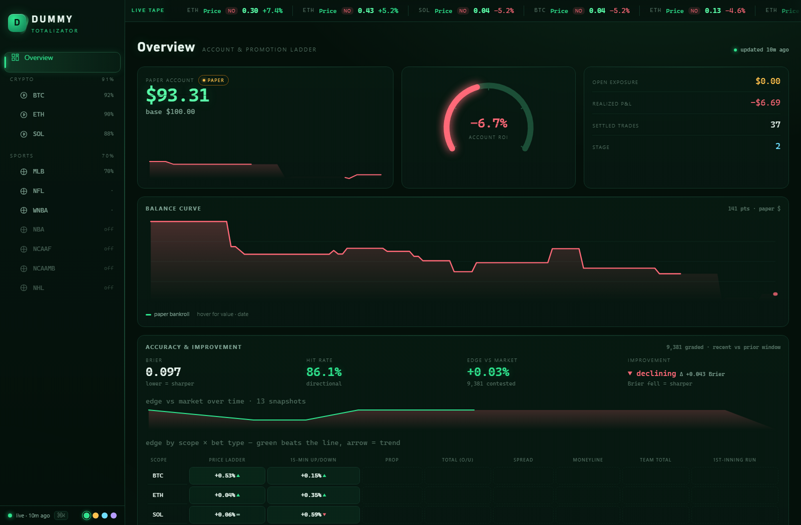
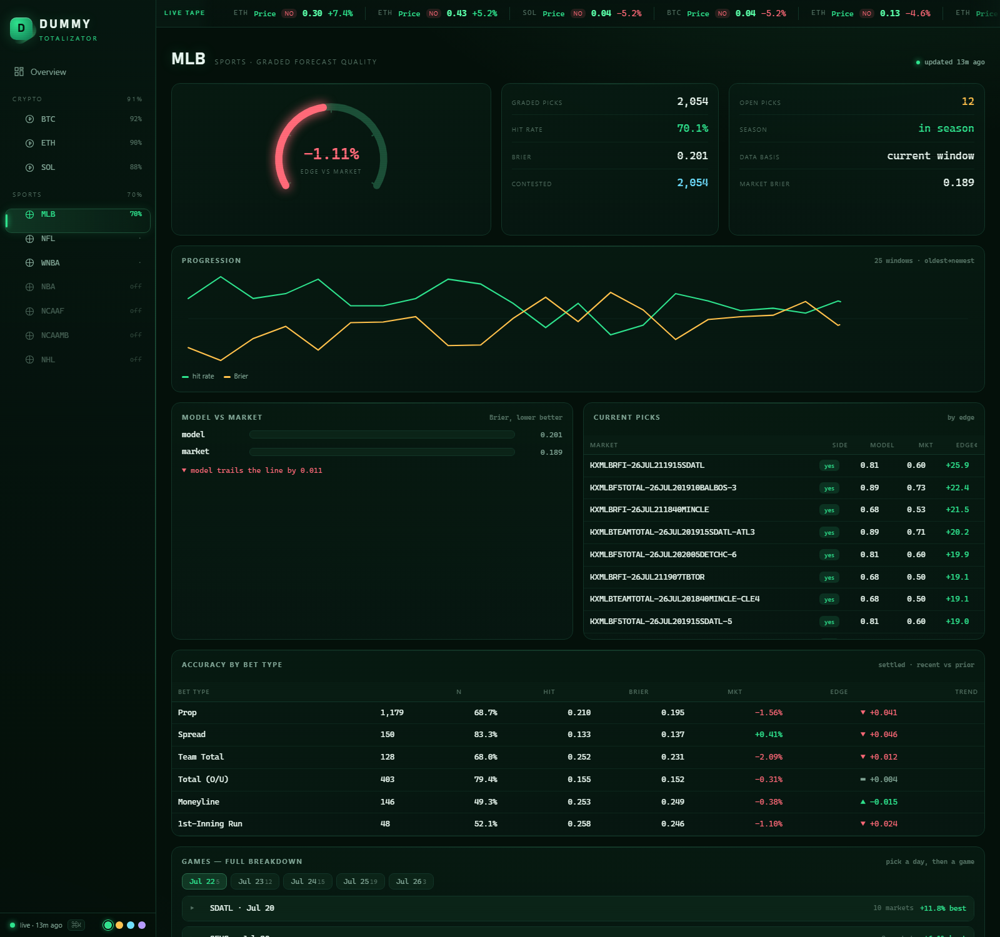
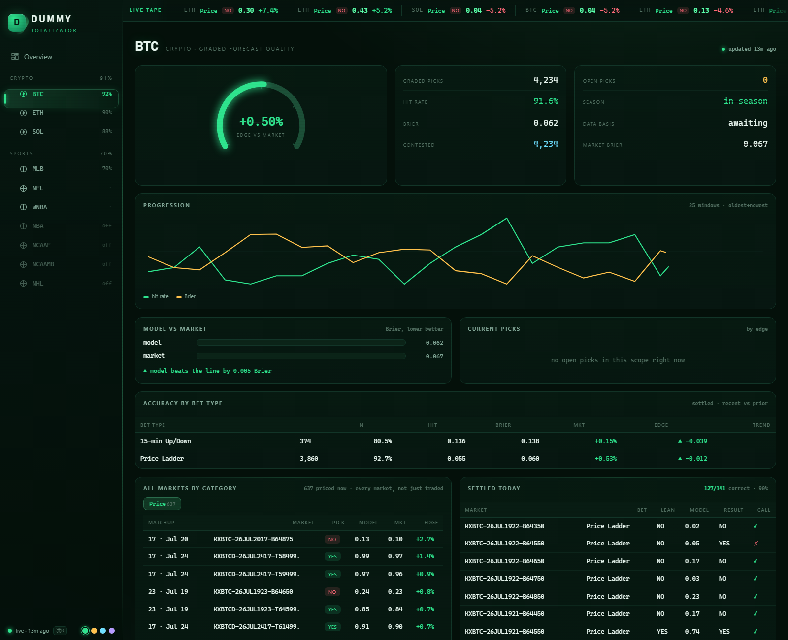
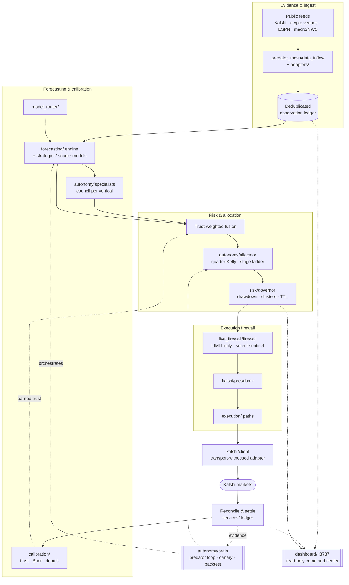

<h1 align="center">Dummy</h1>

<p align="center">
  <strong>Evidence-gated prediction-market intelligence for crypto &amp; sports.</strong><br>
  An autonomous organism that gathers point-in-time public evidence, calibrates
  competing forecasts, earns every source its trust from settled outcomes, and
  explains and records each paper decision in an auditable ledger.
</p>

<p align="center">
  
  
  
  
  
</p>

<p align="center">
  
</p>

<p align="center">
  <em>The <strong>Dummy Totalizator</strong> — a live, read-only command board over the paper
  runtime: paper account and ROI, a phosphor balance curve, and calibrated accuracy with
  per-scope · per-bet-type improvement, all read straight from the runtime artifacts. Split-flap
  counters flip on every re-price; a ⌘K palette jumps to any coin or league.</em>
</p>

<table align="center">
  <tr>
    <td align="center" width="50%"><a href="docs/assets/dummy-sports-scope.png"></a></td>
    <td align="center" width="50%"><a href="docs/assets/dummy-crypto-scope.png"></a></td>
  </tr>
  <tr>
    <td align="center"><em>Per-league view — edge-vs-market, model-vs-book Brier, ranked live picks, accuracy by bet type, and a day-by-day games breakdown.</em></td>
    <td align="center"><em>Per-coin view — the model beating the closing line, accuracy by bet type, every priced market by category, and today's settled calls.</em></td>
  </tr>
</table>

Dummy collects point-in-time public evidence, calibrates competing forecasts,
simulates and stress-tests challengers, explains every paper decision, and
records the full lifecycle in an auditable ledger.

- **Crypto arsenal:** BTC, ETH, and SOL across native 15-minute, hourly, daily,
  and weekly horizons, combining realized and implied volatility, market and
  macro risk regime (S&P/DXY/VIX/10y/gold/oil), momentum, technical, volume,
  order-book, and cross-venue evidence.
- **Sports arsenal:** MLB winners, totals, spreads, and YRFI/NRFI — with real
  left/right platoon splits, per-team bullpen quality, rivalry/divisional
  awareness, probabilistic baserunning, and a gated StatsAPI plate-appearance
  simulator for confirmed live lineups and starters; NBA, NCAAB, NFL, NCAAF,
  and NHL winner/spread/total markets, each priced by a league-specific pregame
  and live kernel and cross-checked by a power-ratings ensemble challenger
  (ESPN FPI/BPI, in-house Elo, and in-house Massey and tie-aware Colley ratings
  computed from public final scores). NFL and NCAAF overtime is possession-aware
  and fail-closed without ESPN drive state, while NHL uses a
  positive-shared-component bivariate Poisson.
  (UFC and Formula One retired 2026-07-12.)
- **Sports history lake &amp; rating superstore:** a point-in-time SQLite lake of
  **95,810 real games** — NCAAMB, NCAAF, NBA, NFL, WNBA, and MLB — ingested from
  open public schedule feeds (nflverse, cfbfastR, and the sportsdataverse data
  repos) through a polite cached/rate-limited fetcher, never a paywall or key.
  Six challenger analytics price the full game surface off it — Glicko-2, 538-style
  MOV-Elo, Pythagenpat, Dean-Oliver Four Factors, EPA/play, and a scoring model for
  spreads and totals — each graded by an event-purged walk-forward backtest that
  predicts before it updates (no leakage). A daily self-tuner re-optimizes each
  league's home-edge from the fresh lake, and every league runs on its own isolated
  scheduler so one league can never stall another. Deep history sharpens the edge:
  MOV-Elo hits 72.9% / +0.070 on NCAAF and Glicko-2 72.0% / +0.068 on 51.9k graded
  NCAAMB games. Every analytic is challenger-only and reaches capital only through
  the human-gated promotion ladder.
- **Training arsenal:** point-in-time replay, Monte Carlo simulation,
  adversarial arenas, event-purged walk-forward validation, calibration and
  risk analytics, deterministic replay buffers, and bounded recursive
  challenger evolution.
- **Autonomous-improvement arsenal:** a two-stage promotion ladder that earns
  challengers their place from settled evidence, a counterfactual
  execution-policy tournament, pre-game CLV capture, keyless fantasy and
  cross-venue intake, empirical per-scope reliability curves, an event-driven
  live-game poller, governance-gated player-prop plumbing, and an
  Intelligence-Lab campaign sweep with Benjamini-Hochberg false-discovery
  control. See [`docs/IMPROVEMENT_WAVES.md`](docs/IMPROVEMENT_WAVES.md).

Live execution remains fail-closed, evidence-gated, and subject to explicit
operator authorization.

## The command board

The **Dummy Totalizator** is a read-only web command board served at
`http://127.0.0.1:8787` (durable via the `DummyDashboard` scheduled task). It
reads only the runtime artifacts the scheduled loops already write — it never
touches the trading path — and turns the live paper runtime into a racetrack
totalizator: pitch-green phosphor, split-flap lamps that flip on every re-price,
a live ticker tape, a radial ROI gauge, and a ⌘K palette that jumps to any coin
or league.

- **Overview** — paper account and ROI, the balance curve, and an
  Accuracy &amp; Improvement panel that grades Brier, hit rate, and edge-vs-market,
  then tracks whether they are *improving over time* — sliced overall, then per
  coin and league, then down to each **bet type** (winner, total, spread,
  moneyline, prop, price-ladder, YRFI/NRFI, …).
- **Per-coin / per-league scopes** — one view each for BTC/ETH/SOL and every
  sports league: graded forecast quality, a hit-rate-and-Brier progression
  chart, model-vs-de-vigged-book comparison, live picks ranked by edge, accuracy
  by bet type, a day-by-day **games full-breakdown**, and today's settled calls
  marked correct or incorrect. Out-of-season leagues stay listed with an
  *out of season* badge and their last-season basis, never hidden.
- **Promotion, health, and switches** — every challenger scope closest to
  promotion first, scheduler health, and per-vertical enable/disable controls
  that only pause paper loops — they cannot reach live execution, credentials,
  risk, or capital.

A companion native desktop board, the **Dummy Tote** (PySide6), renders the same
runtime artifacts as a true native app with a taskbar tray and bet notifications;
it launches at logon and also never touches the trading path.

## Architecture

At the top level Dummy is a one-directional pipeline — public evidence flows in,
competing forecasts are calibrated and fused by earned trust, allocation and
risk gates size a candidate, and a hardened firewall is the only path to the
Kalshi adapter. The autonomy loop orchestrates the cadence and the read-only
dashboard observes it; neither can bypass the firewall or the risk gates.



The runtime cadence of this pipeline — `scan → signal → fuse → allocate →
risk → execute → reconcile → learn` — is described under [The loop](#the-loop),
and the recursive calibration that closes it is under
[Recursive improvement](#recursive-improvement).

## vNext: sovereign forecasting architecture

Dummy's next architecture is a deterministic, typed forecasting ecology:
market-specific agent organisms consume versioned world state, generate
competing futures, challenge one another, estimate their knowledge boundary,
and either issue a fully replayable forecast or abstain. The system may evolve
research components, but it may never evolve its truth rules, promotion
standards, credential boundaries, execution firewall, or operator authority.

The implementation is an adapter-first migration—not a rewrite of proven
specialists—and every new subsystem starts as
`EXPERIMENTAL_SOVEREIGN_FORECASTING`. The reviewed architecture, staged
delivery plan, benchmark claims, and exit gates are documented in
[`docs/VNEXT_MASTER_PLAN_INTEGRATION.md`](docs/VNEXT_MASTER_PLAN_INTEGRATION.md).
Phase 0/1 now has a frozen
[`evidence baseline`](docs/VNEXT_PHASE0_BASELINE.json), a reviewed
[`governance audit`](docs/VNEXT_PHASE0_GOVERNANCE_AUDIT.md), and an executable
[`protected-surface manifest`](docs/VNEXT_PROTECTED_SURFACES.json). These add no
execution authority; current canary and scale gates remain blocked by the
recorded operational evidence.

Phase 2 adds the inactive, research-only
[`agent control plane`](docs/VNEXT_PHASE2_AGENTIZATION.md) and its canonical
[`contract catalog`](docs/VNEXT_PHASE2_CONTRACT_CATALOG.json): versioned
contracts, lifecycle, health, permissions, deterministic mailbox/runtime, and
read-only incumbent adapters. Phase 3 adds the first deterministic,
[`shadow-only forecast organism`](docs/VNEXT_PHASE3_ORGANISM.md) and compact
[`template catalog`](docs/VNEXT_PHASE3_TEMPLATE_CATALOG.json) for native BTC
15-minute direction and MLB pregame winner markets. Each episode freezes
point-in-time evidence, generates and attacks competing futures, emits a typed
forecast or abstention, simulates witnessed-depth paper execution, settles and
grades every role, replays bounded proposals on distinct held-out clusters,
and then dissolves. It cannot substitute for the incumbent or modify weights,
orders, promotion, or capital.

Phase 4 adds the immutable
[`horizon- and league-specific world model`](docs/VNEXT_PHASE4_WORLD_MODELS.md)
and its canonical [`schema catalog`](docs/VNEXT_PHASE4_WORLD_MODEL_SCHEMAS.json).
Every fact, derived value, hypothesis, contradiction, and missing value carries
typed uncertainty and provenance. Critical state is lease-bound and fails
closed when stale or incoherent; every organism role propagates the same frozen
content version. Current [`ablation`](docs/VNEXT_PHASE4_WORLD_STATE_ABLATION.json)
and [`regime-transfer`](docs/VNEXT_PHASE4_REGIME_TRANSFER.json) artifacts
honestly report insufficient settled evidence, so they make no performance or
readiness claim.

Phase 5 adds the [`contraction-only shadow, structured synthesis, and
metacognitive control layer`](docs/VNEXT_PHASE5_METACOGNITION.md). Eight guards
can only downgrade, request evidence, quarantine, veto, abstain, or terminate;
family-aware synthesis preserves a reviewed 0.50 market-prior floor and gives
stale evidence zero weight. Confidence is decomposed into 12 independently
auditable components, while unknown compute remains unknown and blocks a
marginal-utility claim. The checked-in
[`abstention`](docs/VNEXT_PHASE5_ABSTENTION_VALUE.json),
[`resource-efficiency`](docs/VNEXT_PHASE5_RESOURCE_EFFICIENCY.json), and
[`meta-calibration`](docs/VNEXT_PHASE5_METACOGNITION_CALIBRATION.json) reports
honestly contain no settled cases, so Phase 5 remains shadow-only with its
empirical evidence gates pending.

Phase 6 adds the [`layered causal memory, forecast-genome, and bounded recursive
evolution system`](docs/VNEXT_PHASE6_MEMORY_EVOLUTION.md). Immutable observation,
episode, settlement, fill, failure, calibration, strategy, theory, and genome
records form a tamper-evident causal ledger. Generation-zero BTC 15-minute and
MLB pregame genomes may produce proposal-only research descendants across six
recursive levels, but the constitutional manifest prevents mutations from
reaching truth, evidence, evaluation, promotion, credential, or execution
surfaces. Candidate families are judged externally using purged held-out event
clusters, clustered intervals, Holm-Bonferroni correction, and transfer tests.
The checked-in [`evolution evidence`](docs/VNEXT_PHASE6_EVOLUTION_EVIDENCE.json)
contains zero genuine settled candidates and reports
`INSUFFICIENT_SETTLED_EVIDENCE`; no source edit, runtime application,
performance claim, automatic promotion, or execution authority is granted.

Phase 7 adds the [`read-only intelligence observatory, adversarial arenas, and
homeostasis controller`](docs/VNEXT_PHASE7_OBSERVATORY_ARENAS.md). The
observatory projects command-center, organism, world-model, calibration,
execution-truth, evolution, health, and constitutional state with an evidence
link for every claim. The complete 40-scenario arena catalog covers forecast,
sports, crypto, and metacognitive failure modes; all checked-in fixture replays
are deterministic. Nineteen health variables can produce contraction-only or
proposal-only interventions that never increase authority. The current
[`observatory snapshot`](docs/VNEXT_PHASE7_OBSERVATORY_SNAPSHOT.json) explicitly
contains no live vNext telemetry, and the arena report contains zero runtime
episodes, so these artifacts prove mechanics and governance—not empirical
resilience or production readiness.

Phase 8 adds the protected [`benchmark, claim-by-claim evidence, and human-only
promotion review program`](docs/VNEXT_PHASE8_CLAIMS_PROMOTION.md). Its 32-metric
catalog covers forecast, multi-agent, metacognitive, execution, evolution, and
governance quality. The current review supports zero performance claims,
records two governance-only findings, and marks six claims as
`INSUFFICIENT_EVIDENCE`; material improvement is not established. The aggregate
remains `SHADOW_ONLY`, with 12 of 13 promotion evidence gates unsatisfied.
Promotion is blocked, unrequested, human-only, and unapplied.

The protected [`nested forecast autoresearch loop`](docs/VNEXT_AUTORESEARCH.md)
extends Phase 6 with a separate outer evolution researcher and inner forecast
research organism. Sealed visible/private/external task partitions, aggregate-
only private receipts, lineage-bandit search, stall-triggered champion forks,
role-specific context compression, eight reward-hacking canaries, complexity
Pareto pressure, semantic minimization, and a matched-budget ignition harness
make recursive research executable without giving candidates control of their
evaluator. The 2026-07-15 multi-cohort pass compiled 4,937 causally eligible
settlements, discovered 26 exact cohorts, and completed 11 independently
budgeted campaigns (55 lineage trials). Five candidates survived private
selection and two ETH daily-price-ladder candidates survived external testing;
both are frozen for exact-cohort forward paper, where they currently have zero
new settlements. The [`ignition report`](docs/VNEXT_AUTORESEARCH_IGNITION.json)
therefore still supports Level 0 autonomous experimentation only—not
net-positive self-improvement. Source edits, runtime application, automatic
promotion, execution, and capital authority remain absent.

Above that domain loop, the protected
[`Intelligence Research Lab`](docs/INTELLIGENCE_RESEARCH_LAB.md) treats
forecasting as its first experimental adapter and researches intelligence
methods themselves. It converts grounded failures and unknowns into ranked
questions, applies explicit computational-creativity operators, emits
falsifiable hypotheses and fixed-budget experiment protocols, and records the
result in content-addressed, hash-chained scientific memory. Its cognitive
genomes can describe reasoning, research, creativity, evaluation, memory, and
role-organization methods; they contain no authority, truth, promotion, or
execution genes. Cross-domain replication gates prevent a successful prompt or
isolated benchmark from becoming a "theory": provisional theories require
three valid replications across two domains and general laws require six across
three. The live observatory currently supports cognitive Level 0 only, with no
completed lab experiment or validated theory, and grants no automatic
promotion, execution, or capital authority.

The [`final master-plan audit`](docs/VNEXT_MASTER_PLAN_FINAL_AUDIT.md) maps all
38 design sections to concrete evidence and verifies the complete 20-step
forecast capability. Its result is `PASS_WITH_EMPIRICAL_GATES_OPEN`: the
architecture is integrated, but material improvement remains unestablished and
vNext remains `SHADOW_ONLY`. Historical dashboards are route-lazy-loaded, which
preserves all 293 archived views while reducing the production entry bundle
from 720.51 KB to 302.00 KB.

## Current paper operation

The market-horizon paper twin runs every five minutes through the Windows
`DummyCryptoPaperTwin` scheduled task. It continuously scans public Kalshi
markets for BTC, ETH, and SOL at native 15-minute, hourly, daily, and weekly
horizons, plus daily and weekly WTI, natural-gas, and gold cohorts. Each cycle
records the point-in-time market state, target selection, probability, policy
gates, simulated fill evidence, settlement, and a plain-language decision
explanation in the local audit ledger and report artifacts.

This is live **paper** operation only: it has no credentials, broker contact,
execution authority, or capital authority. It remains active while clean
forward evidence accumulates. Promotion is a separate, explicit review gated
by settled out-of-sample calibration, event-cluster robustness, witnessed-fill
performance after fees and slippage, drawdown limits, and the canary firewall.
Elapsed runtime, backtests, or counterfactual quote P&L cannot promote it.

The latest checked-in [`evidence and performance cycle`](docs/EVIDENCE_PERFORMANCE_CYCLE_2026-07-15.json)
grades 4,772 decision snapshots across 1,312 event clusters. Aggregate Brier
skill remains positive (+5.40%), but verified fill P&L is -251c and crypto
fill-conditioned skill is -21.41%, so canary and scale remain blocked. Current
sports settlement evidence is MLB-only: exact joint-cohort guards quarantine
pregame underdog totals and balanced-price winners while continuing shadow
grading; no conclusion is transferred to another league.

The local command-center dashboard at `http://127.0.0.1:8787/` (durable via the
`DummyDashboard` scheduled task; run `scripts/install_dashboard_task.ps1`, which
self-elevates through a UAC prompt) tracks scheduler
health, active and settled paper trades, decision explanations, lane-level
calibration and P&L, target-evidence progress, weaknesses, and promotion gates.
It also exposes the isolated forced-coverage ledgers for every designated
crypto scope and sports prediction type so missing markets, explanations, and
settlements are visible without contaminating promotion evidence, plus a
council-of-specialists panel (status, season state, settled/contested
evidence volume, CLV, open opportunities per specialist — read-only, fails
closed to an empty panel when no snapshot has been written yet). Its Start
and Stop controls only enable or pause the paper schedulers; they cannot reach
live execution, credentials, risk settings, or capital.

## Council of specialists

Every vertical (MLB, NBA, NFL, NCAAF, NHL, NCAAMB, crypto) is owned end-to-end
by its own specialist subagent behind one protocol — pre-game forecast,
in-play view, independent sharp "book" estimator, feed warmup, and health
(`autonomy/specialists/`). Routing is disjoint (one market, one specialist)
and every specialist fails closed: missing data means abstain, never a
degraded guess. NBA/NHL plus separate NFL, NCAAF, and NCAAMB live-state
models expose in-play winner/spread/total views; de-vigged ESPN event-summary
moneylines and exact-strike spread/total lines supply the independent live
book legs. ESPN exposes one current main spread/total, so unmatched alternate
strikes use an explicit league-width challenger curve anchored to that
de-vigged main price; malformed or one-sided books still abstain. Verified hard
ESPN availability statuses apply bounded position-weighted pregame margin
adjustments, while soft statuses widen uncertainty only; explicit play-by-play
ejections are receipt-timestamped, evidence-only
opportunist context and never double-adjust the live score. MLB can replace its
incumbent live opinion with a distinct StatsAPI plate-appearance challenger only
when both starters, confirmed 9-player lineups, and at least 75% batter-rate
coverage are present; hydration failure preserves the incumbent path. Leagues
auto-wake/sleep with their real season (ESPN
scoreboard window, no hardcoded calendar), CLV-vs-closing-line and
settlement-backed contested Brier both accrue per specialist as challenger
evidence, and a human-gated propose-then-promote pipeline is the only way
evidence ever reaches the execution ensemble. The dashboard's council panel
(below) surfaces per-specialist status, season state, evidence volume, and
CLV read-only. Details: [docs/AUTONOMY.md](docs/AUTONOMY.md#council-of-specialists).

The market-state routing that assigns one specialist per market — the layer
that decides *"who governs this market"* — is documented in
[docs/MARKET_STATE_ROUTING.md](docs/MARKET_STATE_ROUTING.md).

**Power-ratings ensemble.** Each team league carries a challenger that blends
several independent rating sources — ESPN FPI/BPI (keyless, first-party),
in-house Elo, and in-house Massey (ridge least-squares over margins) and Colley
(win-loss matrix) ratings computed from public settled scores — into one
consensus point margin. Each source declares its own point-margin scale, and
the ensemble prices a coherent winner-plus-spread ladder from a single
distribution plus an opportunistic divergence flag when the ensemble and the
league kernel disagree while sources agree. It is challenger-only: it accrues
CLV and Brier evidence but never reaches capital until an explicit human
promotion. No ratings site is scraped; the Massey and Colley methods are
replicated in-house from public final scores. Completed ties remain explicit
feed facts and enter Colley as half a win plus half a loss for each team;
unresolved results remain excluded. NCAAF uses its own compound-Poisson
scoring-event distribution for both its specialist and power-ratings paths,
not the NFL absolute-margin tilt.

## The loop

```
scan → signal → fuse → allocate → risk → execute → reconcile → learn
```

Every cycle (10-minute cadence via a scheduled task) the predator sweeps the
watchlist series, prices every market with every applicable source, fuses
opinions by earned trust, ranks opportunities by capital velocity
(edge per √hour-to-settlement), sizes with quarter-Kelly under a stage
ladder, places maker-first LIMIT orders in the active book (shadow by
default), reconciles settlements, and grades every source against reality.

## Recursive improvement

- **Calibration**: every settlement Brier-scores every source that opined —
  globally, per-vertical (`source@VERTICAL`), and at the exact source ×
  asset/league × market-type × phase/horizon scope — and updates trust
  multiplicatively. Influence is earned by beating the market, nothing else.
- **Autonomous recursive repair**: every metabolic recalibration diagnoses
  fill and sports performance by independent event clusters, relearns exact-
  scope trust, and writes contraction-only joint cohort quarantines. A guarded
  cohort abstains but keeps producing shadow grading evidence, so recovery can
  be measured and proposed for human release later. Quarantines are sticky;
  positive results can request human review, but cannot auto-promote, restore
  an execution path, enable execution, or increase capital.
- **Contested truth**: trust and the live gate key on the *contested* record
  (markets where a source disagreed with the market prior by ≥5¢ — the
  population it would actually trade). Agreeing with the market and being
  right proves nothing.
- **Phantom grading**: every forecasted market (~1,000/cycle) is settled and
  graded when it closes, not just the handful traded — evidence accrues at
  hundreds of settlements per day.
- **Retro replay**: point-in-time reconstruction against already-settled
  markets (historical candles + historical forecasts + contemporaneous
  market quotes from candlesticks), no lookahead.
- **Metabolic recalibration**: every ~6h the daemon re-runs the backtest
  bootstrap and refits the debias curve. No operator in the loop.
- **Model evolution**: challengers run beside champions under their own
  source names and earn their way in or starve.
- **Protected nested autoresearch**: a read-only compiler converts settled
  ledger evidence into purged visible/private/external tasks, then allocates a
  fixed experiment budget across independent research lineages. Private gates
  return only aggregate receipts; survivors must pass external and later
  forward-paper evaluation before a human may review promotion. The first real
  campaign supports autonomous experimentation (Level 0) only. The scheduler
  now discovers every viable exact cohort, gives each its own fixed budget and
  forward registry, and never transfers private evidence between scopes.
- **Independent autonomous cohort gates**: evidence accrual, readiness,
  challenger search, contraction, and demotion run independently for every
  source × asset/league × prediction type × phase/horizon. A strong BTC-15m
  head is not blocked by another crypto horizon, and MLB YRFI/NRFI cannot be
  blocked or promoted by MLB winner evidence. Cross-cohort transfer is
  forbidden; promotion activation remains human-only. The 2026-07-15 real-ledger
  readiness pass evaluated 149 well-formed exact cohorts, found zero promotion
  candidates, and produced zero automatic demotions.
- **Crypto correlation control**: Coinbase flat-vol, blend-sigma, and empirical
  regime transforms share one distribution family; macro-regime and
  crypto-equity drift share one cross-asset family. Enabling correlated
  challengers can redistribute family weight but cannot manufacture additional
  precision. Crypto retains a 25% market anchor and challengers remain excluded
  until explicit promotion review.
- **Technical-foundry challenger**: a clean-room, MIT-compatible review of
  ObtuseAI/dopey added an independently named crypto lane for ATR-normalized
  momentum, Bollinger/stochastic location, OBV flow, volume anomalies, and
  breakout/fakeout confirmation. It reuses Dummy's cached public OHLCV,
  abstains without agreement, caps its distribution shift, and remains excluded
  from fusion until its exact asset/contract/horizon gate earns promotion.
- **Simulation training**: an hourly read-only curriculum searches
  shrinkage/edge/uncertainty policies with settlement-lagged, event-purged
  walk-forward tests; separately trains witnessed-fill execution filters and
  cluster-bootstrap compounding stress. It can propose a bounded shadow
  experiment but cannot change weights, risk, readiness, or orders.
- **Always-on market-horizon paper twin**: every five minutes, the exact crypto
  universe (BTC/ETH/SOL at native 15m, hourly, daily, and weekly horizons) and
  WTI/natural-gas/gold daily/weekly cohorts run isolated incumbent, recursive,
  and exploratory lanes. Unlisted horizons abstain explicitly; listed markets
  explain every decision, simulate one-contract top-ask entries, and diagnose
  maker execution from public prints. It runs beside shadow and authorized live
  sessions but has no credentials, broker, readiness, execution, or capital
  authority. A physically separate coverage-probe ledger also forces a paper
  side for every real, valid nearest-expiry crypto target in all 12 asset/horizon
  scopes, records the normal-policy blocker, and exposes missing scopes as gaps.
  Forced crypto samples cannot influence calibration, promotion, readiness, or
  execution. Hourly and daily terminal-price organisms autonomously choose
  among every contemporaneously listed nearest-expiry strike using conservative
  fee/uncertainty-adjusted EV. They cannot invent a strike, use settlement to
  select one, or replay an alternative unless the full decision-time ladder was
  frozen; hourly and daily strike policies have separate promotion gates.
- **Multi-sport game engine**: MLB, NFL, NCAAF, NHL, NBA, and NCAAB
  challengers feed a deterministic replay buffer and Monte Carlo curriculum.
  League-isolated genomes progress through Rookie/Veteran/Elite/Boss tiers,
  face fog-of-war/meta-shift/boss-chaos arenas, and unlock mutation skills only
  after settled event-cluster evidence. Deep analytics include Brier, log loss,
  ECE/MCE, AUC, sharpness, Sortino, drawdown, and paired-cluster confidence.
  A separate forced-coverage lane paper-trades every real, signal-compatible
  designated winner/total/YRFI-NRFI market and explains the decision;
  missing types become explicit coverage gaps. Forced samples cannot promote a
  model, rewrite code, alter production weights, or reach capital. NFL winner
  is also retained as an explicit gap while listed contracts accumulate
  scope-specific forward settlement and calibration evidence.
- **Loss-deconstruction evolution engine**: a deterministic nightly pass groups
  settled trades by grading scope, finds where the system bleeds versus the
  market (cluster-level Brier shortfall with 95% intervals and disclosed family
  size), and buckets each bleeding scope by feature regime, market type, and
  phase. An LLM narration layer adds plain-language commentary per scope. The
  output is a read-only artifact that orders the tuner's target priority
  (non-gating) and surfaces a "where we bleed" line on the dashboard — it
  mutates no source, parameter, or promotion.
- **Reflexion**: losing decisions distilled into structured lessons via the
  model router.

## Autonomous improvement (waves 1–4)

Branch-first, fail-closed feature waves layered on the autonomy core. Every new
signal is challenger-only and reaches execution solely through the promotion
ladder; nothing here touches the allocator, executor, or risk directly. Full
program summary in [`docs/IMPROVEMENT_WAVES.md`](docs/IMPROVEMENT_WAVES.md).

- **Promotion ladder** — a two-stage autonomous engine promotes a scope only on
  ≥300 independent event-clusters, contested-Brier edge CI95 lower > 0,
  non-negative CLV, and no degradation; auto-demotion is one-way-safe.
  Promotion to execution authority is still a human edit of `promotions.json`.
- **Execution-policy tournament** — C0–C4 counterfactual cohorts replay the
  actionable ledger to rank maker/taker/adverse-guard policies; report-only,
  never auto-switched.
- **Sports CLV** — freezes the pre-game close as the true closing line, feeding
  the promotion ladder's CLV criterion.
- **Fantasy & cross-venue intake** — keyless ESPN fantasy (ownership/scratch)
  and Polymarket cross-venue reference pricing, each a challenger source.
- **Empirical reliability curves** — isotonic per-scope recalibration for crypto
  and every sports league, pre-game and live, gated by cluster count.
- **Live-game poller** — event-driven, reacts to score/inning/base-out/status
  deltas; off by default behind an explicit flag.
- **Player-prop plumbing** — fixtures-first, behind an unopened, key-gated
  governance slot.
- **Intelligence-Lab sweep** — mines the instrumented evidence across many
  cohorts on the visible partition only, controlling the portfolio
  false-discovery rate with Benjamini-Hochberg and disclosing the full family
  searched.

Verify any worktree the way CI does with `bash scripts/verify_wave_clean.sh`
(add `--cov` for the coverage gate).

## Success measurement and execution truth

- Source trust is graded at the **earliest decision timestamp** for traded
  markets, or the earliest recorded opinion for phantom-only markets. Later
  near-settlement quotes cannot rewrite the evidence that produced a trade.
- A shadow maker order is pending until a public standard-book trade consumes
  its captured queue, prints strictly through its limit, or a later quote/
  one-minute candle proves a cross. Uncrossed orders expire on the same
  1-minute crypto / 45-minute other-market TTL as live orders and never create
  positions or P&L. Fixed-point dollar books are normalized explicitly.
- Accepted live orders reserve risk, but settlement P&L uses only the broker's
  witnessed cumulative `fill_count`. Partial fills survive cancellation as
  real positions; unfilled orders settle with zero P&L.
- Allocation uses the current series-aware maker-fee schedule plus a
  half-sigma probability haircut. If the embedded fee schedule is older than
  31 days, maker estimates fail closed to the higher taker fee.
- `run_dummy_backtest.py` reports verified realized P&L, fill quality, final
  ensemble Brier/log loss versus the contemporaneous market, and one-snapshot-
  per-market edge-threshold diagnostics. Counterfactual midpoint results are
  explicitly separated from fill-adjusted realized performance.
- Backtest uncertainty is event-cluster aware: adjacent strikes for the same
  expiry are resampled together instead of pretending every contract is an
  independent observation. Reports include 95% Brier/log-loss advantage
  intervals, ECE/MCE calibration, strict chronological stability folds, and
  point-in-time walk-forward threshold selection that only trains on outcomes
  settled before the next test window.
- Signal intake persists the exact feature payload and receipt timestamp.
  Non-finite/range-invalid probabilities, malformed feature JSON, future
  timestamps, and duplicate signal grains are quarantined and surfaced in the
  dashboard instead of entering calibration.
- Allocation requires a two-sided book with a spread no wider than 20¢ and
  refuses an order when remaining budget cannot buy one contract or more than
  50 contracts are already queued at its price. Shadow and live share these
  execution filters. Shadow equity and drawdown use verified settled-fill P&L,
  not a fixed paper balance.
- Raw public statistics are kept in a separate deduplicated observation table
  with series, observation/publish/receipt times, units, and feature payloads.
  BLS macro releases, Deribit BTC/ETH DVOL, and official NWS station readings
  cannot influence forecasts until a settlement-backed transformation exists.
- River ADWIN monitors chronological Brier excess for statistically unusual
  degradation. It is diagnostic only; confirmed negative drift blocks scale
  readiness rather than silently changing weights.
- OR-Tools produces a report-only discrete portfolio challenger, and Polars
  exports hash-manifested Parquet research snapshots through a query-only
  SQLite connection. Neither path has execution authority.

## Self-managed risk

- Quarter-Kelly sizing under a stage ladder (SHADOW → CANARY → RAMP →
  CRUISE); promotion strictly on realized settled P&L, demotion instant.
- Drawdown ladder: −10% half size, −20% demote, −30% hard self-stop.
- Correlation clustering: adjacent strikes / city-days / both game sides
  collapse into one cluster with its own caps.
- Stage close-horizon: early stages only hold near-dated markets so
  position slots recycle.
- Exchange-enforced order TTL (1min crypto / 45min elsewhere) instead of
  cancel loops.

## Safety invariants

- **Evidence gate**: a LIVE canary refuses to start until ≥20 settled markets,
  ≥100 settled decision snapshots across ≥20 event clusters, a positive
  cluster-robust Brier advantage, ≤8% calibration error, ≥100 profitable
  point-in-time walk-forward trades, bootstrapped weights, one statistically
  positive contested source, five witnessed shadow fills, five settled fills
  with positive verified P&L, and positive fill-conditioned Brier skill exist.
- **Canary is not scale**: scale readiness is reported separately and remains
  blocked until at least 20 witnessed fills have settled with positive verified
  net P&L. Counterfactual performance can authorize a tiny experiment, never a
  capital ramp.
- Live orders go through a hardened firewall adapter: LIMIT only,
  per-order validation, transport-witnessed truth (broker contact is
  claimed only on HTTP evidence).
- Maintenance awareness: exchange down → cycle skips cleanly; trading
  paused → learning continues, zero orders.
- Circuit breakers quarantine failing sources; errors are eaten as
  evidence, never stalls.
- The kill file stops everything, instantly and unconditionally.
- **Repository quality gate**: `python -m ruff check .` must pass
  repository-wide. Exceptions are restricted to immutable vendored snapshots,
  archived historical layouts, and executable path-bootstrap scripts; active
  forecasting, safety, and test code remains fully checked.

## Operator surface

The evaluated open-source expansion backlog and licensing boundaries are in
[`docs/OPEN_SOURCE_OPPORTUNITY_AUDIT.md`](docs/OPEN_SOURCE_OPPORTUNITY_AUDIT.md).

```bash
python scripts/run_dummy_autonomous.py start          # shadow session
python scripts/run_dummy_autonomous.py canary --live  # evidence gate + balance
python scripts/run_dummy_autonomous.py start --live --ack "<exact ack>"
python scripts/run_dummy_autonomous.py stop           # instant, unconditional
python scripts/run_dummy_dashboard.py --port 8787     # read-only dashboard
python scripts/run_dummy_retro_backfill.py --bootstrap
python scripts/ingest_dummy_public_statistics.py       # public facts, local ledger only
python scripts/export_dummy_research_snapshot.py       # SQLite mode=ro -> Parquet
python scripts/run_dummy_portfolio_challenger.py --budget-cents 500 --max-positions 8 --max-group-cost-cents 150
python scripts/run_dummy_simulation_training.py --summary   # report-only, ledger mode=ro
powershell -ExecutionPolicy Bypass -File scripts/install_simulation_training_task.ps1
python scripts/run_dummy_crypto_paper_twin.py --summary
powershell -ExecutionPolicy Bypass -File scripts/install_crypto_paper_twin_task.ps1
Get-ScheduledTaskInfo -TaskName DummyCryptoPaperTwin
python scripts/run_dummy_ledger_retention.py                 # dry-run: settled signals older than 7d
python scripts/run_dummy_ledger_retention.py --apply --vacuum # verified archive, then reclaim hot DB pages
```

Ledger retention moves only immutable signal rows for markets settled longer
than seven days into `runtime/autonomy/archive/signals_archive.db`. Every batch
must match exact row counts and a SHA-256 content digest before the hot rows are
deleted in the same SQLite transaction. Research readers use the unioned
`signal_history` view, so calibration/readiness evidence remains unchanged;
decisions, outcomes, settlements, trust, promotions, and execution files are
never eligible. Dry-run is the default. Stop ledger-writing tasks before an
`--apply --vacuum` maintenance pass.

The hourly trainer also runs the quarantined recursive evolution lab. It
mutates bounded research genomes, replays them causally, stress-tests degraded
execution, and accumulates later forward evidence without changing production
code, weights, risk, orders, or capital. See `docs/EVOLUTION_LAB.md`.

Details: [docs/AUTONOMY.md](docs/AUTONOMY.md).
Training protocol: [docs/SIMULATION_TRAINING_REGIMEN.md](docs/SIMULATION_TRAINING_REGIMEN.md).
Crypto audit: [docs/CRYPTO_PERFORMANCE_AUDIT.md](docs/CRYPTO_PERFORMANCE_AUDIT.md).
Evidence governance review: [docs/EVIDENCE_GOVERNANCE_REVIEW_2026-07-14.md](docs/EVIDENCE_GOVERNANCE_REVIEW_2026-07-14.md).
Crypto paper twin: [docs/CRYPTO_PAPER_TWIN.md](docs/CRYPTO_PAPER_TWIN.md).
vNext integration plan: [docs/VNEXT_MASTER_PLAN_INTEGRATION.md](docs/VNEXT_MASTER_PLAN_INTEGRATION.md).
