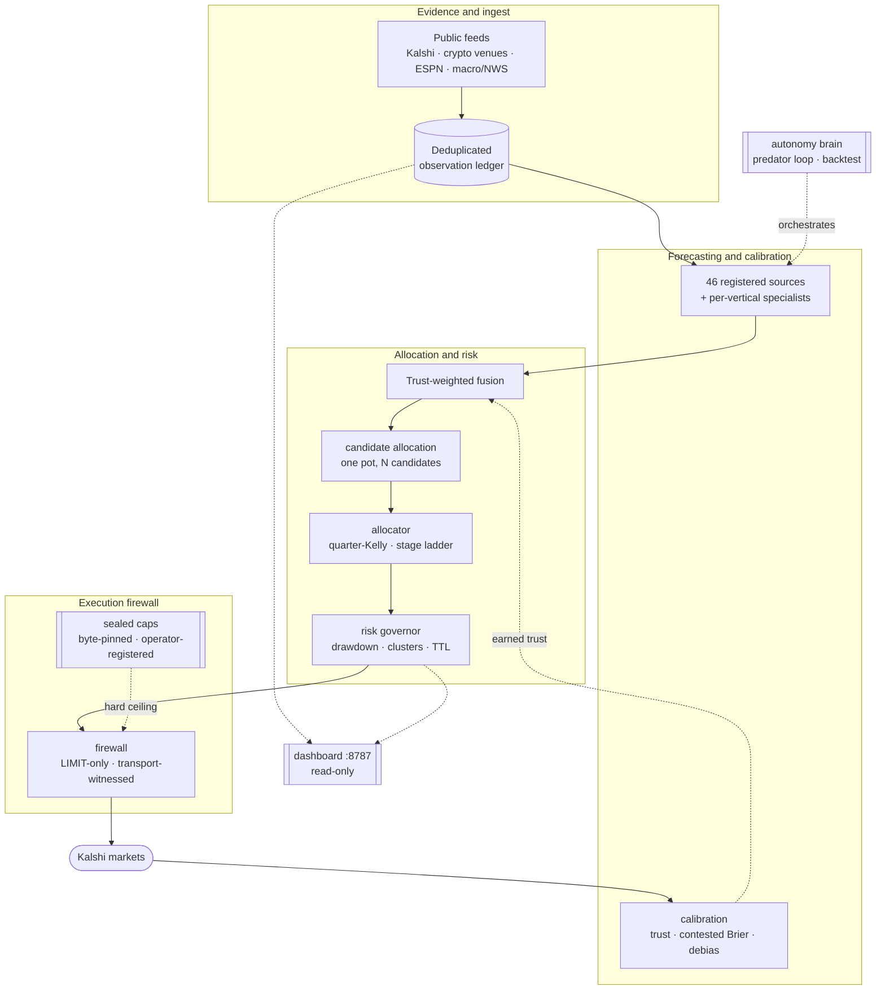

<h1 align="center">Dummy</h1>

<p align="center">
  <strong>Evidence-gated prediction-market intelligence for crypto &amp; sports.</strong><br>
  An autonomous organism that gathers point-in-time public evidence, calibrates
  competing forecasts, earns every source its trust from settled outcomes, and
  explains and records each paper decision in an auditable ledger.
</p>

<p align="center">
  
  
  
  
  
  
</p>

<p align="center">
  
</p>

<p align="center">
  <em>The <strong>Dummy operator board</strong> — a loopback-only, read-only view of persisted
  account, authority, health, forecast, and grading artifacts. Split-flap counters update only
  when evidence changes; a ⌘K palette jumps to any coin or league.</em>
</p>

<table align="center">
  <tr>
    <td align="center" width="50%"><a href="docs/assets/dummy-sports-scope.png"></a></td>
    <td align="center" width="50%"><a href="docs/assets/dummy-crypto-scope.png"></a></td>
  </tr>
  <tr>
    <td align="center"><em>Per-league view — edge-vs-market, model-vs-book Brier, ranked live picks, accuracy by bet type, and a day-by-day games breakdown.</em></td>
    <td align="center"><em>Per-coin view — the model beating the closing line, accuracy by bet type, every priced market by category, and today's settled calls.</em></td>
  </tr>
</table>

---

> **Current launch status: NO-GO.** The hardened code path is implemented, but
> live operations still fail the retention/WAL/deadline gates and lack the
> required elapsed backup, canary, grading, execution-policy, and kill-drill
> evidence. See the
> [elite-readiness implementation record](docs/ELITE_READINESS_IMPLEMENTATION_2026-07-26.md).

Dummy watches public prediction markets, prices every one of them with a panel of
competing models, and grades every forecast against reality the moment it settles.
Sources that beat the market earn trust; sources that don't, starve. Nothing reaches
capital automatically — the whole system runs as an always-on **paper** twin, and a
human is the only path from evidence to a real order.

**Contents** — [What it prices](#what-it-prices) · [Command board](#the-command-board) ·
[Design](#design) · [The cycle](#the-cycle) · [Capital allocation](#capital-allocation) ·
[The 45 loops](#the-45-loops) · [The organization](#the-organization-around-the-models) ·
[Recursive improvement](#recursive-improvement) · [Safety](#safety--governance) ·
[Numbers](#by-the-numbers) · [Quickstart](#operator-quickstart)

## What it prices

- **Crypto** — BTC, ETH, and SOL across native 15-minute, hourly, daily, and weekly
  horizons. Each market is priced from realized and implied volatility, a market/macro
  risk regime (S&amp;P · DXY · VIX · 10y · gold · oil), momentum, technical structure,
  order-book pressure, and cross-venue reference prices — fused by earned trust with a
  standing market anchor.
- **Sports** — MLB, WNBA, NBA, NFL, NHL, NCAAF, and NCAAMB: winners, spreads, totals,
  team totals, first-half/quarter/period segments, and MLB YRFI/NRFI and player props.
  Each market is priced by a league-specific pregame and live kernel, cross-checked by a
  power-ratings ensemble and a de-vigged multi-book consensus. Leagues wake and sleep with
  their real season — out of season, a scope shows its last-season basis instead of vanishing.
- **Sports history superstore** — a point-in-time lake of **162,915 real games**
  (150,894 of them strictly evaluation-eligible under the provenance gate) across six
  leagues — NCAAMB (104.8k), NBA (23.1k), NCAAF (13.5k), MLB (9.4k), NFL (7.5k), and
  WNBA (4.6k); NHL is not yet in the lake (0 games, deferred until its data source comes
  online in October) — ingested from open public feeds through a polite cached fetcher —
  no paywall, no key. **Eleven challenger analytics** price the full game surface off it: Glicko-2,
  538-style MOV-Elo, Pythagenpat, Dean-Oliver Four Factors, EPA/play, a spread/total scoring
  model with likelihood-tuned sigmas, a rest/travel mean shift, live win probability, a
  referee/official total adjustment, and a minutes-and-usage player-prop projection. Each is
  graded by an event-purged walk-forward that predicts before it updates, and a daily
  self-tuner re-optimizes every league's parameters from the fresh lake.
- **Play-by-play knowledge lake** — **32,298 games of real play-by-play** across all six
  data-covered leagues (NBA, NCAAMB, WNBA, NFL, MLB innings, NHL periods), folded into
  empirical margin/total distributions, per-period scoring profiles, and
  **comeback matrices** — P(win | lead entering each period) from tens of thousands of real
  games — that feed live re-pricing and simulator calibration cross-checks.

An exact **four-model LLM panel** (Gemini 3.6 Flash, GPT-5.6 Luna, Claude Sonnet 5,
GLM-5.2) reviews the top pick each cycle in a seven-call atomic contract — statically routed,
fail-closed on any missing or malformed voice, double-locked behind a paid-call gate with an
enforced daily USD ceiling, and **structurally quarantined from fusion**: every voice is graded
against settlements like any other source, and model influence requires its own 300-cluster
forward-evidence dossier.

Every model is a **challenger**: it accrues Brier and closing-line evidence but never reaches
capital until an explicit human promotion.

## The command board

The **Dummy operator board** is the one supported UI. It is served at
`http://127.0.0.1:8787` by the `DummyDashboard` scheduled task and rejects non-loopback
socket peers and Host headers. It reads persisted runtime artifacts, exposes GET-only routes,
and has no scheduler, configuration, authority, risk, capital, or broker mutation endpoint.

- **Overview** — cached live-account truth, explicit `LOCKED` / `ARMED / NO SESSION` /
  `LIVE` authority state, health and freshness, and forecast-quality diagnostics kept
  separate from realized execution evidence.
- **Per-coin / per-league scopes** — one view each for BTC/ETH/SOL and every sports league:
  graded forecast quality, a hit-rate-and-Brier progression chart, model-vs-de-vigged-book
  comparison, live picks ranked by edge, accuracy by bet type, a day-by-day games breakdown,
  and today's settled calls marked correct or incorrect.
- **Crypto research charts** — locally rendered BTC/ETH/SOL candlesticks for
  15m/1h/4h/1d/1w, deterministic indicators, pattern markers, artifact age,
  and source provenance. The renderer is the vendored Apache-2.0 TradingView
  Lightweight Charts library; data comes from a separately rights-reviewed
  public API, never from TradingView scraping, cookies, widgets, or accounts.
- **Promotion and health** — challenger evidence, blockers, scheduler observations, source
  freshness, and local redacted model-connectivity witnesses. Refreshing the board never
  contacts a broker or model provider.

`desktop/launch_dummy.py` is an optional thin wrapper around the same URL. It starts a
single-instance, read-only Windows outcome notifier; there is no second native renderer,
Android app, Node/React client, tailnet listener, or PySide environment.

## Design

Public evidence flows in one direction — deduplicated, priced by competing models, fused by
earned trust, divided across candidates, sized under a risk governor, and only ever reaching
the exchange through a hardened firewall. The autonomy loop sets the cadence; the read-only
dashboard observes it. Neither can bypass the firewall or the risk gates.



Each stage can only ever *reduce* what the stage before it proposed. Fusion cannot outvote
calibration, allocation cannot exceed the pot, the risk governor cannot exceed the allocation,
and the firewall cannot exceed the sealed caps. There is no path where a later stage grants
more than an earlier one allowed.

## The cycle

Every cycle runs the same eight phases:

```
scan → signal → fuse → allocate → risk → execute → reconcile → learn
```

The predator sweeps the watchlist, prices each market with every applicable source, fuses
by earned trust, ranks by **capital velocity** (edge per √hour-to-settlement — a 3¢ edge
settling in an hour compounds faster than a 5¢ edge parked for five days), divides one
capped pot across the candidates that can actually be held, sizes each with quarter-Kelly
under a stage ladder, places maker-first LIMIT orders (shadow by default), reconciles
settlements, and grades every source against reality.

Phase timings are recorded per cycle, which is how the LLM debate was found to dominate
per-cycle cost and subsequently parallelized, and how a recalibration's N+1 query storm was
traced and batched from 40–107 minutes down to 76 seconds.

## Capital allocation

Sizing a single order and dividing a budget across many are different problems, and for a
long time only the first was solved.

`autonomy/risk_brain.py` derives its own limits from live bankroll, realized calibration and
drawdown state — quarter-Kelly, a SHADOW → CANARY → RAMP → CRUISE ladder, correlation-group
caps. It sizes **one** order well. But nothing divided a budget across the candidate *set*:
the top-ranked candidate took the entire remaining budget its own caps allowed, a near-equal
rival got nothing, and forty qualifying candidates sized identically to three.

`autonomy/candidate_allocation.py` is the missing half — a pure function that splits one pot
across everything qualifying at once, weighted by **demonstrated** forecast quality:

| policy | rule | deploys full pot |
|---|---|---|
| `kelly_prorata` *(default)* | each ask scaled by weight; if the total overflows, apportioned to fit | no |
| `proportional` | share of the pot by weight, clamped to the ask | yes |
| `top_k` | fund the highest-weighted K in full, starve the tail | up to K |

Weight comes from **contested Brier advantage** — how much better the model's Brier is than
the market's own price on the same rows — using the *lower 95% bound*, the same quantity the
promotion gate already tests. A scope with twelve lucky rows cannot size up on evidence its
sample count will not support.

Two rules the implementation learned the hard way, both now property-tested:

- **Weights are a contention tiebreak, not a discount.** If every ask fits the pot, every ask
  is granted in full. An early version multiplied each ask by its weight unconditionally, so a
  lone 100¢ ask from an unproven scope became 25¢ against a 200¢ pot — below the price of one
  contract, and trading stopped silently. A change that sizes everything to zero looks
  conservative and is not safety.
- **Divide across holdable slots, not evaluated candidates.** A hundred candidates are
  evaluated per cycle but a stage may permit five open markets. Splitting a pot a hundred ways
  puts every grant under one contract.

Invariants, enforced by property tests over generated inputs: `Σ granted ≤ pot` always;
`granted ≤ ask` always, so the allocator can only ever reduce and every existing cap still
binds behind it; adding a candidate never raises an existing grant; and the weight floor is
never zero, because a scope that can never be allocated can never settle, never accrue
evidence, and never earn its way up.

Allocation policy remains an explicit configuration workflow in
`configs/allocation.json`; it is intentionally absent from the read-only dashboard. The
throttle can only *shrink* the pot — enlarging it past the sealed ceiling requires the
operator caps ceremony, not a UI slider.

## The 45 loops

Dummy is not a program you run; it is **45 independent scheduled loops** that survive reboots,
pick up merged code on their next fire, and are individually watched. Nothing is a daemon —
each is a Windows scheduled task running as the operator, so a crash costs one fire, not the
system.

**Cadence — the heartbeat (8)**
`DummyShadowPredator` (the brain cycle) · `DummyLivePoller` · `DummySportsBoardRefresh` ·
`DummyMispricingMonitor` · `DummyCryptoPaperTwin` · `DummyVnextShadow` (shadow organism) ·
`DummyUseSidecar` · `DummyLiveAccountSnapshot`

**Learning and self-improvement (10)**
`DummyWeightsRecal` (fast weight-only core) · `DummyBacktestReport` (heavy diagnostics, split
out so a slow report cannot stall a cycle) · `DummyTune` · `DummySelfImprovement` ·
`DummyStrategyMiner` · `DummyAutoresearch` · `DummySimulationTrainer` ·
`DummySportsSimulation` · `DummySportsModelSeed` · `DummyCryptoHorizonEvidence`

**Sports data and grading — per league (18)**
`DummyLake_{mlb,nba,ncaaf,ncaamb,nfl,nhl,wnba}` (history backfill) ·
`DummyWF_{mlb,nba,ncaaf,ncaamb,nfl,nhl,wnba}` (event-purged walk-forward) ·
`DummyBox_{nba,ncaamb,wnba}` (box-score ingest) · `DummyEpa_nfl`

**Health and durability (5)**
`DummyWatchdog` (fleet-wide; grades other tasks, not its own exit code) · `DummyHealer`
(5-minute self-heal and reconnect) · `DummyReadinessReport` · `DummyDashboard` ·
`DummyDashboardSnapshot` (so the board never holds a ledger lock)

**Bounded footprint (4)**
`DummyLedgerRetention` · `DummyLedgerPrune` · `DummyLedgerVacuum` (self-skipping) ·
`DummyLogRotation` (explicit allowlist — state, audit and full-history tapes are *never*
blind-truncated)

The footprint is deliberately bounded on disk: a signal-prune that keeps exactly the
backtester-selected row per (source, market) proved weight-neutral and shrank the hot ledger
from 10.6M to 5.9M signals, and log rotation caps tail-only tapes by line while leaving
`promotion_ledger`, `preregistrations`, `paper_entries` and the CLV book tape intact.

## The organization around the models

The models compete; an instrumented organization coaches them, borrowed from the best
front offices and labs:

- **Self-scout** — the fused forecast's own tendencies (directional lean, favorite/longshot
  calibration, overconfidence, post-loss drift) audited daily, before the market finds them.
- **Film room** — the worst settled forecasts individually reconstructed: who dissented,
  what the market knew, which sources saw it better.
- **Recruiting board** — one ranked talent pipeline across mined rules, compiled strategy
  claims, harvested repositories, and challenger scopes, staged PROSPECT → STARTER/CUT,
  with position needs from the no-edge map.
- **Matchup lens & top threat** — every letter-tier edge graded source-strength ×
  market-softness (prime isolation vs bait), and the single book concentration that would
  hurt most named every cycle.
- **Development tracker** — watches the tuner and ingestion machinery itself, so a silent
  outage becomes a next-morning headline.
- **Strategy claim compiler** — prose claims (Reddit, video, README) formalized into
  falsifiable specs; the unfalsifiable are rejected, the testable get faithful
  interpretations and a reproducibility record.
- **Evolution lab** — a quality-diversity archive with grid mutation **and true crossover**,
  settlement-ratcheted mutation pressure, causal replay, and a parameter-jitter fragility
  verdict on every generation's champion.

These report writers failed silently for days before 2026-07-24; failures now surface in
`runtime/autonomy/report_writer_failures.json` and turn the scheduled run red instead of green.

## Recursive improvement

- **Contested-truth calibration** — every settlement Brier-scores every source that opined,
  globally and at the exact source × asset/league × market-type × horizon scope. Trust keys on
  the *contested* record (markets where a source disagreed with the price by ≥5¢). Agreeing
  with the market and being right proves nothing.
- **Phantom grading** — every forecast market is settled and graded when it closes, not just
  the handful traded, so evidence accrues at hundreds of settlements a day.
- **Self-tuning, no operator in the loop** — a metabolic recalibration refits the debias curve
  every few hours; the sports self-tuner re-optimizes league priors daily from the fresh lake;
  challengers run beside champions under their own names and earn their way in or starve.
- **Honest uncertainty** — backtests are event-cluster aware (adjacent strikes resampled
  together), report 95% Brier/log-loss intervals, and select thresholds by point-in-time
  walk-forward that only trains on outcomes settled before the test window.
- **Ablation, property sweeps, chaos drills** — every source's *marginal* contribution to
  the ensemble is measured leave-one-out (redundancy surfaces daily); thousands of seeded
  randomized cases prove the fail-closed core's invariants universally; and injected faults
  (NaN feeds, garbage payloads, corrupt artifacts) are permanent regression armor proving
  the system degrades instead of guessing.

## Safety &amp; governance

This is live **paper** operation only — no credentials, no broker contact, no execution or
capital authority. The guardrails are structural:

- **Fail-closed everywhere** — missing data means *abstain*, never a degraded guess. A dead
  feed, a malformed book, or a stale fee schedule stops the market cleanly.
- **Human-gated to capital** — an autonomous, fail-closed promotion engine can admit a
  challenger scope into paper *fusion* after settled out-of-sample calibration, event-cluster
  robustness, witnessed-fill performance after fees and slippage, and drawdown limits — but
  live execution authority remains an operator decision behind separate live-authority
  contracts. Elapsed runtime, backtests, or counterfactual quote P&amp;L cannot promote anything.
- **Byte-sealed risk caps** — `configs/caps.json` is pinned by hash. Changing it invalidates
  every approval bound to the previous bytes, and code may register a new protected baseline
  but is structurally forbidden from manufacturing the operator registration needed to *use*
  it. Self-authorization is not a policy here; it is unrepresentable.
- **Deny-by-default market authorization** — a market must be positively authorized by exact
  ticker (`allowed_markets`) or by series (`allowed_series`) before an order can form.
  Series authorization is boundary-aware identifier matching, never category inference:
  `KXSOL15M` does not authorize `KXSOL15MEGA`. Category compliance continues to come only
  from fetched venue metadata, and every negative control — quarantine, blocked categories,
  caps, risk brain — is evaluated independently of it.
- **A claim must carry its own timestamp** — a validated proof candidate's tradability
  expires (`CANDIDATE_MAX_AGE_SECONDS`), and a market never observed reports `null`
  tradability rather than `false`. "Not tradable" and "we never looked" are different facts,
  and the second one used to be recorded as the first.
- **Hardened execution firewall** — LIMIT-only orders, per-order validation, and
  transport-witnessed truth: broker contact is claimed only on HTTP evidence, and settlement
  P&amp;L uses only the broker's witnessed fills.
- **Self-managed risk** — quarter-Kelly under a SHADOW → CANARY → RAMP → CRUISE stage ladder,
  a −10% / −20% / −30% drawdown ladder, correlation clustering, exchange-enforced order TTLs,
  and a kill file that stops everything instantly and unconditionally.

**Why transport-witnessed truth is not a slogan.** Two early proof attempts were recorded as
`BROKER_REJECTED` with `broker_contacted: true`. Neither reached a broker: no submit call was
made, no order endpoint was touched, no payload was ever constructed, and live submit was
disabled throughout. Both were local gate blocks wearing a broker's label, and one of them
latched a safety interlock that held the system closed for sixteen days on an event where no
socket was opened. The rejection classifier, the truth layer, and the on-the-record correction
in [`docs/corrections/`](docs/corrections/) all exist because a narrative artifact and a
mechanical one disagreed, and only the mechanical one was true.

That reflex — a local condition rendered as a fact about the outside world — turned out to be
systemic rather than isolated. A discovery run that made **zero** network requests still
reported `market_tradable: false` and "market is not open for trading". A candidate validated
weeks earlier still asserted a market was tradable, with nothing in the record to date the
claim. A caps blocker sat in front of a credential check and reported its own name instead,
masking the signal the check existed to produce. And the field taxonomy that classifies a caps
change was also the schema-required set, so naming a new field retroactively invalidated
evidence explicitly labelled immutable. Each was found by asking the same question — *what did
this actually observe, and when?* — and each is now a test.

## By the numbers

| | |
|---|--:|
| Markets priced per cycle | 2,500–4,500 |
| Verticals | 3 crypto coins · 7 sports leagues |
| Competing forecast sources | 46 registered |
| Autonomous scheduled loops | 45 |
| Sports history lake | 162,915 point-in-time games (150,894 evaluation-eligible) |
| Play-by-play knowledge lake | 32,298 games, 6 leagues, comeback matrices |
| Sports challenger analytics | 11, walk-forward graded |
| LLM panel | 4 exact models, 7-call atomic, double-locked, daily USD cap |
| Improvement waves shipped | 88 |
| Maintained tests | 4,938 passing · 86 skipped |
| Capital at risk | $0 — paper, human-gated |

## Operator quickstart

```bash
uv sync --frozen --all-extras                         # exact locked environment
python scripts/run_dummy_autonomous.py start          # shadow paper session
python scripts/run_dummy_dashboard.py --port 8787     # read-only command board
python scripts/run_dummy_autonomous.py stop           # instant, unconditional
python scripts/run_dummy_sports_history_backfill.py   # refresh the sports history lake
python scripts/dummy_switches.py --show               # per-vertical paper switches
uv run --frozen python -m pytest -q --timeout=120     # the full test gate
```

Operator configuration lives in `configs/`: `switches.json` (per-vertical paper on/off),
`allocation.json` (candidate split policy and throttle), and `caps.json` (the sealed live
ceiling — changing it requires the registration ceremony, not an edit).

### Environment requirements

- **Python 3.11 or newer** — the floor is real: `core/inherited_blunder/` imports
  `typing.NotRequired`, which lands in 3.11. CI runs 3.11 · 3.12 · 3.14; the live
  workstation runs 3.14.
- **Canonical checkout path `C:\src\engine\dummy`** — identity and artifact-path gates assert
  it, which is why CI mirrors its checkout there before running the suite.
- **Sibling Blunder checkout at `C:\src\engine\obtuse\blunder`** — a *hard requirement for the
  governance suite*, not for running Dummy. `core/inherited_blunder/` is a hash-pinned,
  byte-identical copy of Blunder (pinned by `.blunder_source_manifest.json`, kept verbatim by
  the `F401` exemption in `pyproject.toml`), and the separation tests re-hash the canonical
  sibling checkout against that manifest. Without it — or without an
  `artifacts/dummy/` directory — `tests/conftest.py` skips the tests listed in
  `tests/workstation_only_tests.txt`, including every Blunder copy-integrity and separation
  test. The suite still reports green; it simply stops proving the vendored copy is
  unmodified. No runtime code imports the sibling checkout, so the paper runtime, the
  dashboard, and the thin desktop notifier are unaffected by its absence.

Start with the [operator index](docs/OPERATOR_START_HERE.md) and
[shared state vocabulary](docs/OPERATOR_STATES.md). Deeper detail lives in
[`docs/`](docs/): [autonomy](docs/AUTONOMY.md),
[council of specialists](docs/AUTONOMY.md#council-of-specialists),
[market-state routing](docs/MARKET_STATE_ROUTING.md), the
[crypto paper twin](docs/CRYPTO_PAPER_TWIN.md),
[Market Observer MCP](docs/MARKET_OBSERVER_MCP.md), and design specs and corrections under
[`docs/superpowers/specs/`](docs/superpowers/specs/) and [`docs/corrections/`](docs/corrections/).

<p align="center"><sub>Paper-first · evidence-gated · fail-closed · human-gated to capital.</sub></p>
