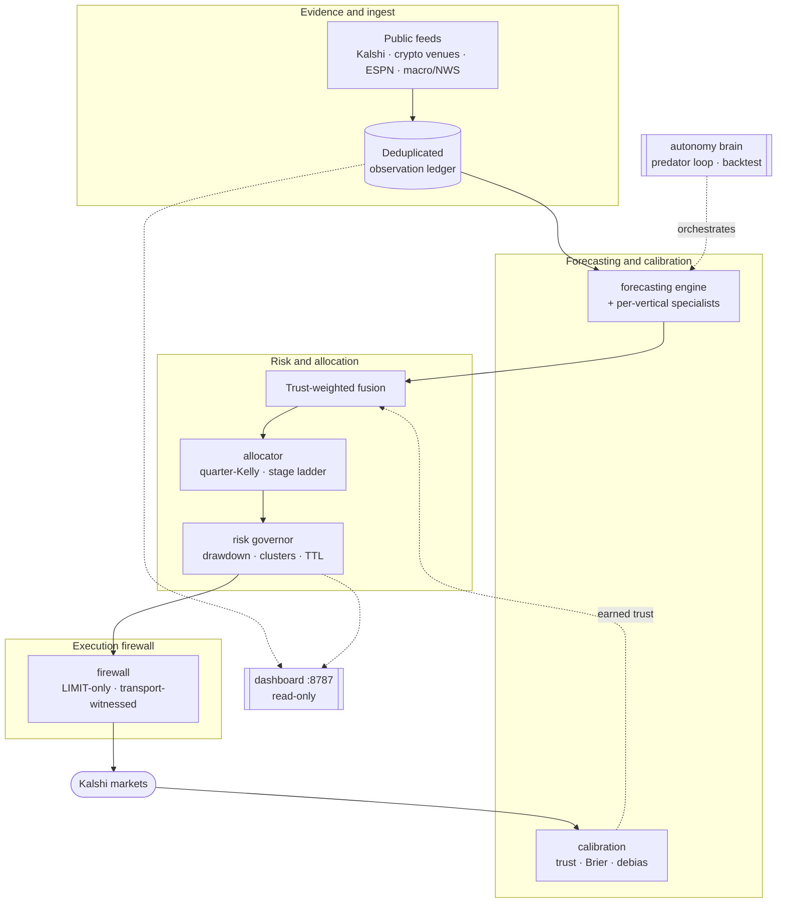

<h1 align="center">Dummy</h1>

<p align="center">
  <strong>Evidence-gated prediction-market intelligence for crypto &amp; sports.</strong><br>
  An autonomous organism that gathers point-in-time public evidence, calibrates
  competing forecasts, earns every source its trust from settled outcomes, and
  explains and records each paper decision in an auditable ledger.
</p>

<p align="center">
  
  
  
  
  
</p>

<p align="center">
  
</p>

<p align="center">
  <em>The <strong>Dummy Totalizator</strong> — a live, read-only command board over the paper
  runtime: paper account and ROI, a phosphor balance curve, and calibrated accuracy with
  per-scope · per-bet-type improvement, all read straight from the runtime artifacts. Split-flap
  counters flip on every re-price; a ⌘K palette jumps to any coin or league.</em>
</p>

<table align="center">
  <tr>
    <td align="center" width="50%"><a href="docs/assets/dummy-sports-scope.png"></a></td>
    <td align="center" width="50%"><a href="docs/assets/dummy-crypto-scope.png"></a></td>
  </tr>
  <tr>
    <td align="center"><em>Per-league view — edge-vs-market, model-vs-book Brier, ranked live picks, accuracy by bet type, and a day-by-day games breakdown.</em></td>
    <td align="center"><em>Per-coin view — the model beating the closing line, accuracy by bet type, every priced market by category, and today's settled calls.</em></td>
  </tr>
</table>

---

Dummy watches public prediction markets, prices every one of them with a panel of
competing models, and grades every forecast against reality the moment it settles.
Sources that beat the market earn trust; sources that don't, starve. Nothing reaches
capital automatically — the whole system runs as an always-on **paper** twin, and a
human is the only path from evidence to a real order.

## What it prices

- **Crypto** — BTC, ETH, and SOL across native 15-minute, hourly, daily, and weekly
  horizons. Each market is priced from realized and implied volatility, a market/macro
  risk regime (S&amp;P · DXY · VIX · 10y · gold · oil), momentum, technical structure,
  order-book pressure, and cross-venue reference prices — fused by earned trust with a
  standing market anchor.
- **Sports** — MLB, WNBA, NBA, NFL, NHL, NCAAF, and NCAAMB: winners, spreads, totals,
  team totals, first-half/quarter/period segments, and MLB YRFI/NRFI and player props.
  Each market is priced by a league-specific pregame and live kernel, cross-checked by a
  power-ratings ensemble and a de-vigged multi-book consensus. Leagues wake and sleep with
  their real season — out of season, a scope shows its last-season basis instead of vanishing.
- **Sports history superstore** — a point-in-time lake of **95,810 real games** (NCAAMB,
  NCAAF, NBA, NFL, WNBA, MLB) ingested from open public schedule feeds through a polite
  cached/rate-limited fetcher — no paywall, no key. Six challenger analytics price the full
  game surface off it: Glicko-2, 538-style MOV-Elo, Pythagenpat, Dean-Oliver Four Factors,
  EPA/play, and a scoring model for spreads and totals. Each is graded by an event-purged
  walk-forward that predicts before it updates, and a daily self-tuner re-optimizes every
  league's home edge from the fresh lake. Deep history sharpens the edge — MOV-Elo hits
  72.9% on NCAAF, Glicko-2 72.0% on 51.9k graded NCAAMB games.

Every model is a **challenger**: it accrues Brier and closing-line evidence but never reaches
capital until an explicit human promotion.

## The command board

The **Dummy Totalizator** is a read-only web board served at `http://127.0.0.1:8787`
(durable via the `DummyDashboard` scheduled task). It reads only the runtime artifacts the
scheduled loops already write — it never touches the trading path — and turns the live paper
runtime into a racetrack totalizator: pitch-green phosphor, split-flap lamps that flip on every
re-price, a live ticker tape, a radial ROI gauge, and a ⌘K palette that jumps to any coin or league.

- **Overview** — paper account and ROI, the balance curve, and an Accuracy &amp; Improvement
  panel that grades Brier, hit rate, and edge-vs-market, then tracks whether they are
  *improving over time* — sliced overall, then per coin and league, then down to each **bet
  type** (winner, total, spread, moneyline, prop, price-ladder, YRFI/NRFI, …).
- **Per-coin / per-league scopes** — one view each for BTC/ETH/SOL and every sports league:
  graded forecast quality, a hit-rate-and-Brier progression chart, model-vs-de-vigged-book
  comparison, live picks ranked by edge, accuracy by bet type, a day-by-day games breakdown,
  and today's settled calls marked correct or incorrect.
- **Promotion, health, and switches** — every challenger scope closest to promotion first,
  scheduler health, and per-vertical enable/disable controls that only pause paper loops —
  they cannot reach live execution, credentials, risk, or capital.

A companion native desktop board, the **Dummy Tote** (PySide6), renders the same artifacts as a
true native app with a taskbar tray and bet notifications.

## How it works

Public evidence flows in one direction — it is deduplicated, priced by competing models,
fused by earned trust, sized under a risk governor, and only ever reaches the exchange
through a hardened firewall. The autonomy loop sets the cadence; the read-only dashboard
observes it. Neither can bypass the firewall or the risk gates.



Every cycle runs `scan → signal → fuse → allocate → risk → execute → reconcile → learn`:
the predator sweeps the watchlist, prices each market with every applicable source, fuses
by earned trust, ranks by capital velocity (edge per √hour-to-settlement), sizes with
quarter-Kelly under a stage ladder, places maker-first LIMIT orders (shadow by default),
reconciles settlements, and grades every source against reality.

## Recursive improvement

- **Contested-truth calibration** — every settlement Brier-scores every source that opined,
  globally and at the exact source × asset/league × market-type × horizon scope. Trust keys on
  the *contested* record (markets where a source disagreed with the price by ≥5¢). Agreeing
  with the market and being right proves nothing.
- **Phantom grading** — every forecast market is settled and graded when it closes, not just
  the handful traded, so evidence accrues at hundreds of settlements a day.
- **Self-tuning, no operator in the loop** — a metabolic recalibration refits the debias curve
  every few hours; the sports self-tuner re-optimizes league priors daily from the fresh lake;
  challengers run beside champions under their own names and earn their way in or starve.
- **Honest uncertainty** — backtests are event-cluster aware (adjacent strikes resampled
  together), report 95% Brier/log-loss intervals, and select thresholds by point-in-time
  walk-forward that only trains on outcomes settled before the test window.

## Safety &amp; governance

This is live **paper** operation only — no credentials, no broker contact, no execution or
capital authority. The guardrails are structural:

- **Fail-closed everywhere** — missing data means *abstain*, never a degraded guess. A dead
  feed, a malformed book, or a stale fee schedule stops the market cleanly.
- **Human-gated to capital** — promotion to real execution is a human edit of a promotions
  file, only after settled out-of-sample calibration, event-cluster robustness, witnessed-fill
  performance after fees and slippage, drawdown limits, and a canary firewall. Elapsed runtime,
  backtests, or counterfactual quote P&amp;L cannot promote anything.
- **Hardened execution firewall** — LIMIT-only orders, per-order validation, and
  transport-witnessed truth: broker contact is claimed only on HTTP evidence, and settlement
  P&amp;L uses only the broker's witnessed fills.
- **Self-managed risk** — quarter-Kelly under a SHADOW → CANARY → RAMP → CRUISE stage ladder,
  a −10% / −20% / −30% drawdown ladder, correlation clustering, exchange-enforced order TTLs,
  and a kill file that stops everything instantly and unconditionally.

## By the numbers

| | |
|---|--:|
| Markets priced per cycle | ~3,500 |
| Verticals | 3 crypto coins · 7 sports leagues |
| Sports history lake | 95,810 point-in-time games |
| Challenger analytics (sports) | 6, walk-forward graded |
| Tests | 6,490 passing |
| Capital at risk | $0 — paper, human-gated |

## Operator quickstart

```bash
python scripts/run_dummy_autonomous.py start          # shadow paper session
python scripts/run_dummy_dashboard.py --port 8787     # read-only command board
python scripts/run_dummy_autonomous.py stop           # instant, unconditional
python scripts/run_dummy_sports_history_backfill.py   # refresh the sports history lake
bash scripts/verify_wave_clean.sh                     # the full CI gate (add --cov)
```

Deeper detail lives in [`docs/`](docs/): [autonomy](docs/AUTONOMY.md),
[council of specialists](docs/AUTONOMY.md#council-of-specialists),
[market-state routing](docs/MARKET_STATE_ROUTING.md), and the
[crypto paper twin](docs/CRYPTO_PAPER_TWIN.md).

<p align="center"><sub>Paper-first · evidence-gated · fail-closed · human-gated to capital.</sub></p>
